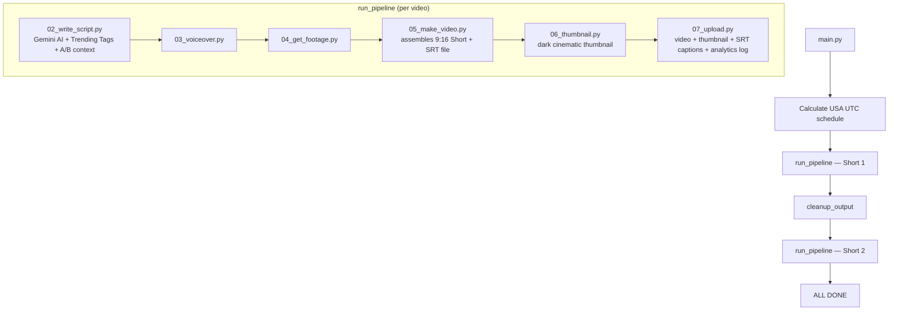

# 🎬 YouTubeBot — Fully Automated Book-to-Shorts Pipeline

> **Automated YouTube Shorts Channel Builder (USA Target Audience)**
> Sequentially reads books · AI-scripted viral angles · TTS voiceover · Premium Black Aesthetic · Centered 4-line subtitles · SRT caption upload · Trending tag injection · Analytics A/B tracking · Music mixing · Auto-upload
> Last Updated: 2026-04-06

---

## 📋 Table of Contents

- [Overview](#overview)
- [Architecture & Flow](#architecture--flow)
- [Book Content System](#book-content-system)
- [Pipeline Steps](#pipeline-steps)
- [SEO & Growth Strategy](#seo--growth-strategy)
- [Thumbnail System](#thumbnail-system)
- [Trending Tags](#trending-tags)
- [Analytics & A/B Testing](#analytics--ab-testing)
- [File Structure](#file-structure)
- [Configuration](#configuration)
- [Known Issues & Fixes](#known-issues--fixes)
- [Running the Bot](#running-the-bot)

---

## Overview

YouTubeBot is a **high-growth YouTube Shorts engine** targeting USA audience (18–35 demographic: money, growth, success, discipline). It **sequentially reads `.pdf` books**, extracting two pages per day, and generates 2 highly-engaging vertical YouTube Shorts — one emotional storytelling angle, one direct advice angle.

All SEO metadata (title, description, tags, category) is now fully optimized for YouTube's algorithm with live Google Trends injection and an A/B analytics feedback loop that improves Gemini prompts automatically over time.

| Component | Technology | Cost |
|-----------|-----------|------|
| **Script Writing** | **Gemini API** (`gemini-2.0-flash`) | Free |
| **Paging System** | Custom Python Chunker + JSON Progress Tracking | Free |
| **Voiceover** | **Microsoft Edge TTS** (`en-US-GuyNeural`) | Free |
| **Video Background** | **Dynamic Black Generation** (lavfi black color) | Free |
| **Subtitles** | **FFmpeg SRT** (Middle Center `Alignment=10`) + **SRT Upload to YouTube** | Free |
| **Thumbnail** | **PIL Dark Cinematic** (white + yellow accent + red bar) | Free |
| **Trending Tags** | **Google Trends** via pytrends (6h cache) + evergreen fallback | Free |
| **Analytics** | **YouTube Analytics API v2** (views, likes, A/B pattern tracking) | Free |
| **Background Music** | Local MP3 file | Free |
| **Upload** | **YouTube Data API v3** | Free |

---

## Architecture & Flow

### Production Schedule ([main.py](main.py))

The bot schedules two Shorts to go live at USA prime time viewing windows:

| Video | Publish Time (EST) | Upload Time (UTC) | Content Angle | Category |
|-------|-------------------|-------------------|---------------|----------|
| Short 1 | 9:00 AM EST | 14:00 UTC | Emotional Storytelling | 22 — People & Blogs |
| Short 2 | 4:00 PM EST | 21:00 UTC | Direct Advice / Hard Truth | 27 — Education |

### Pipeline Flow



---

## Book Content System

At the heart of the channel's value proposition is the `books/` directory parsing behavior.

1. Create a `books/` directory in the project root.
2. Drop in a PDF format book (e.g., `books/atomic_habits.pdf`).
3. During Video #1 execution the AI reads `books/progress.json`.
4. It extracts exactly 2 physical pages of text from the PDF (starting at `current_page`). You can manually edit `progress.json` to set `"current_page": 15` to skip preface pages, or `"end_page": 200` to stop before the glossary.
5. The Gemini API converts these 2 pages into 2 different Short scripts simultaneously.
6. `current_page` increments by 2; the second script is cached for Short 2.
7. Next day the bot reads the next consecutive 2 pages automatically.
8. The bot flags completion and waits for the next `.pdf` when a book is finished.

> **Important:** The book name is intentionally **never used in the video title or description** — this maximizes discoverability. Random viewers don't search for a book they haven't heard of.

---

## Pipeline Steps

### Step 1: Script Generation — [scripts/02_write_script.py](scripts/02_write_script.py)

Reads the book slice, calls Gemini API, and transforms raw text into 2 viral Short scripts targeting the US market. Output includes Hook, Script Body, CTA, plus full SEO metadata.

**New in this version:**
- **Viral title formats** — 12 proven patterns (e.g. `"The Brutal Truth About Why You're Still Losing #Shorts"`) — no book name, always ends with `#Shorts`, always under 60 characters for full mobile display.
- **A/B performance context** — If the analytics tracker has enough data, the top-performing title patterns from your own channel are injected into the Gemini prompt so the AI learns what works and writes more of it.
- **Trending tag injection** — After script generation, live Google Trends data is merged into the tags list.
- **`category_id` in output** — `22` for emotional storytelling, `27` for direct advice.

Output paths: `output/sections/`, `output/seo_data.json`, `output/latest_script.txt`, `book_shorts_cache.json`.

---

### Step 2: Voiceover — [scripts/03_voiceover.py](scripts/03_voiceover.py)

Passes all text sections to Microsoft Edge TTS (`en-US-GuyNeural`, `-5%` rate, `-3Hz` pitch). Slightly slower and deeper for a cinematic, authoritative delivery. Outputs per-section MP3s to `output/voiceovers/`.

---

### Step 3: Visual Background — [scripts/04_get_footage.py](scripts/04_get_footage.py)

Determines video length and calculates per-section subtitle timings. Stock footage is skipped in favour of a clean premium black aesthetic.

---

### Step 4: Short Assembly — [scripts/05_make_video.py](scripts/05_make_video.py)

The powerhouse renderer. Merges MP3s, probes duration for exact pacing, generates a native **1080×1920 black background**.

- Subtitles burned in **absolute middle center** (`Alignment=10`) in 4-line blocks (fontsize 14) for maximum retention.
- Saves `output/subtitles.srt` — reused by the uploader for caption upload.
- Produces two outputs: `final_video.mp4` (subtitles + music, for YouTube) and `video_for_reel.mp4` (clean, for Instagram).

---

### Step 5: Thumbnail — [scripts/06_thumbnail.py](scripts/06_thumbnail.py)

Generates a high-CTR **1280×720 thumbnail** — visible at 180px (YouTube's smallest display size).

**Design:**
- Dark cinematic gradient background (`#080814` → `#140A23`)
- Title split into 2 lines — last word of each line in **YELLOW (#FFD700)**, rest in **bold white**
- Hard black border on all text (readable on any background)
- Red accent bar between the two text lines (authority signal)
- `@IRONMINDSET` watermark bottom-right

Output: `output/thumbnail.jpg`

---

### Step 6: Upload — [scripts/07_upload.py](scripts/07_upload.py)

Connects to YouTube Data API v3 and performs a full upload sequence.

**Order of operations:**
1. Read `output/seo_data.json` for title, description, tags, `category_id`
2. Upload `output/final_video.mp4` (scheduled private → auto-published at target time)
3. Upload `output/thumbnail.jpg` (skip gracefully if channel not verified)
4. Upload `output/subtitles.srt` as English captions via `captions().insert()` — **YouTube indexes captions for search, giving a free SEO boost with zero extra work**
5. Log upload to `analytics_performance.json` for A/B tracking

---

## SEO & Growth Strategy

Every video produced by this pipeline is optimized across five layers:

### 1. Title
- **Pattern:** Proven viral formats — curiosity-gap, challenge, hard truth, story promise
- **No book name** — title is designed for cold discovery, not existing readers
- **`#Shorts` suffix** — confirmed YouTube algorithm signal for Shorts feed classification
- **Under 60 characters** — full display on mobile without truncation
- **Examples:**
  - `"Stop Doing This If You Want to Actually Win #Shorts"`
  - `"Nobody Told Me This Would Change Everything #Shorts"`
  - `"The Brutal Truth About Why You're Still Losing #Shorts"`

### 2. Description
YouTube shows only **1–2 lines before "Show more"** — these are the SEO goldmine.

**Structure:**
```
Line 1: [Primary keyword phrase] — [direct benefit or shocking fact]
Line 2: [Secondary keyword phrase] | [curiosity gap or statistic]
(blank)
Hook text from the video
3–4 sentences of value/context
(blank)
Follow for daily [topic] content that actually works.
🔔 Subscribe — new short every single day
👍 Like if this hit different
💾 Save this — you'll need it when life gets hard
(blank)
15 hashtags: #Shorts #YouTubeShorts + niche-specific
```

### 3. Tags (30–40 per video)
Three-tier strategy:
- **Broad** (high traffic): `motivation`, `self improvement`, `mindset`, `discipline`
- **Mid** (medium competition): `daily habits`, `morning routine`, `success mindset`
- **Long-tail** (high intent): `how to be disciplined`, `how to build good habits`
- **Viral references**: `atomic habits`, `david goggins`, `stoicism`, `alex hormozi`
- **Trending**: live injected from Google Trends (see [Trending Tags](#trending-tags))

### 4. Category
Set dynamically based on content angle — not hardcoded:
| Angle | Category ID | Category Name |
|-------|------------|---------------|
| Emotional storytelling | 22 | People & Blogs |
| Direct advice | 27 | Education |

### 5. Hashtag Block
First hashtag in the description becomes the video's label in the Shorts feed — always `#Shorts` first, then the most relevant niche hashtag. 15 hashtags total, tailored per content category.

---

## Thumbnail System

The thumbnail redesign in [scripts/06_thumbnail.py](scripts/06_thumbnail.py) prioritizes **click-through rate (CTR)** over aesthetics.

| Element | Design Decision | Why |
|---------|----------------|-----|
| Background | Dark cinematic gradient | Stands out from bright stock footage thumbnails |
| Title text | Bold white, 120pt | Readable at 180px (smallest YouTube display) |
| Accent word | YELLOW (#FFD700) last word per line | Eye catches yellow before anything else |
| Text border | 4px hard black shadow | Readable on any background color |
| Red bar | Between lines, 55% screen width | Authority signal, breaks visual monotony |
| Watermark | `@IRONMINDSET` bottom-right, 32pt | Brand building without dominating the design |

The thumbnail is automatically uploaded to YouTube after each video upload. If the channel is not verified for custom thumbnails yet, it skips gracefully.

---

## Trending Tags

[scripts/get_trending_tags.py](scripts/get_trending_tags.py) fetches live trending search terms from Google Trends and injects them into every video's tag list.

**How it works:**
1. On each pipeline run, `get_trending_tags(category)` is called
2. It queries Google Trends (via `pytrends`) for rising searches in the USA related to the video's category
3. Results are **cached for 6 hours** (`trending_tags_cache.json`) — no rate-limit issues from running twice daily
4. If pytrends fails or is rate-limited, it falls back to a curated **evergreen keyword list** (high-performing self-improvement terms: `atomic habits`, `david goggins`, `stoicism`, etc.)
5. New trending tags are deduplicated against existing tags and appended

**Supported categories:**
`discipline_habits`, `mental_strength`, `success_mindset`, `life_philosophy`, `overcoming_failure`, `focus_productivity`, `general`

---

## Analytics & A/B Testing

[scripts/analytics_tracker.py](scripts/analytics_tracker.py) tracks every upload and measures real-world performance to continuously improve the pipeline.

### How it works

**At upload time** (`07_upload.py` calls `log_upload()` automatically):
- Records `video_id`, title, angle type, category, upload timestamp
- Classifies the title into a **pattern bucket** (e.g. `nobody_told_me`, `brutal_truth`, `stop_doing`, `99_percent`)

**On demand** (run manually):
```bash
# Pull latest views/likes from YouTube Analytics API for all logged videos
python scripts/analytics_tracker.py --update

# See which title patterns and angles perform best
python scripts/analytics_tracker.py --report

# Show top 3 pattern rankings with avg views
python scripts/analytics_tracker.py --patterns
```

**A/B test loop:**
- Each day's 2 uploads are a natural A/B test: Short 1 (emotional) vs Short 2 (direct advice)
- The tracker compares avg views by angle type and by title pattern
- Top-performing patterns are fed back into the **Gemini prompt the next day** — the AI automatically writes more of what works on your specific channel

### Performance log format (`analytics_performance.json`)
```json
{
  "videos": [
    {
      "video_id": "abc123",
      "title": "Stop Doing This If You Want to Win #Shorts",
      "pattern": "stop_doing",
      "angle_type": "direct advice",
      "views": 142000,
      "likes": 8700,
      "uploaded_at": "2026-04-06T14:00:00",
      "url": "https://youtube.com/shorts/abc123"
    }
  ],
  "pattern_stats": {
    "stop_doing": { "avg_views": 142000, "count": 3, "best_title": "..." }
  }
}
```

---

## File Structure

```
c:\YoutubeShortsAutomation\
├── .env                              # API keys
├── credentials.json                  # YouTube OAuth client secret
├── main.py                           # Production entry point (2 Shorts/day)
│
├── books/
│   ├── progress.json                 # Reading tracker (editable: current_page, end_page)
│   └── your_book.pdf                 # Add PDF books here
│
├── scripts/
│   ├── 02_write_script.py            # Book reader + Gemini AI + SEO + trending tags
│   ├── 03_voiceover.py               # Edge TTS voiceover (GuyNeural)
│   ├── 04_get_footage.py             # Stock footage selector + subtitle timings
│   ├── 05_make_video.py              # Short assembler (9:16 + SRT subtitles + music)
│   ├── 06_thumbnail.py               # Dark cinematic thumbnail generator (NEW DESIGN)
│   ├── 07_upload.py                  # YouTube upload + thumbnail + SRT captions + analytics log
│   ├── get_trending_tags.py          # Google Trends tag fetcher (NEW)
│   └── analytics_tracker.py         # A/B performance tracker + Gemini feedback loop (NEW)
│
├── shared/
│   └── youtube_api.py                # Story series YouTube API (same SEO improvements)
│
├── stock/
│   ├── fire/        (8 clips)
│   ├── morning/     (17 clips)
│   ├── oceans/      (7 clips)
│   └── plants/      (12 clips)
│
├── music/
│   └── background.mp3                # Background music track
│
├── output/                           # Working directory (auto-cleaned between videos)
│   ├── seo_data.json                 # Title, description, tags, category_id, angle_type
│   ├── subtitles.srt                 # Generated SRT — burned into video AND uploaded to YouTube
│   └── thumbnail.jpg                 # Generated thumbnail — uploaded to YouTube
│
├── archive/                          # Backed-up final YouTube Shorts
├── trending_tags_cache.json          # 6-hour Google Trends cache (auto-generated)
├── analytics_performance.json        # Video performance log + pattern stats (auto-generated)
└── book_shorts_cache.json            # Script cache for Video 2 (auto-generated)
```

---

## Configuration

`.env` file:
```env
GEMINI_API_KEY=your_gemini_key_here
YOUTUBE_CLIENT_SECRET=credentials.json
YOUTUBE_TOKEN_FILE=youtube_token.pickle
YOUTUBE_CHANNEL_ID=your_channel_id_here
```

`credentials.json` — Download from [Google Cloud Console](https://console.cloud.google.com):
- Enable **YouTube Data API v3** and **YouTube Analytics API**
- Create OAuth 2.0 credentials → Desktop App → Download JSON

**YouTube API scopes required** (in `07_upload.py`):
```python
SCOPES = [
    "https://www.googleapis.com/auth/youtube",          # upload + manage
    "https://www.googleapis.com/auth/youtube.force-ssl", # captions
]
```

**YouTube Analytics API scopes** (in `analytics_tracker.py`):
```python
SCOPES = [
    "https://www.googleapis.com/auth/yt-analytics.readonly",
    "https://www.googleapis.com/auth/youtube.readonly",
]
```

> Note: Both sets of scopes can be combined into one OAuth flow if you need a single token file.

---

## Known Issues & Fixes

| Issue | Cause | Fix |
|-------|-------|-----|
| **No Book File Crash** | No `.pdf` in `books/` | Bot pauses and prompts — add a PDF and re-run |
| **Center Text Safety** | YouTube mobile covers bottom 25% | Subtitles set to `Alignment=10` (dead center) |
| **Audio Desync** | MP3 frame-padding accumulation | Voiceovers re-encoded (not stream-copied) — exact timing |
| **Quota Exceeded** | YouTube free tier limits | 2 uploads/day is safe; analytics calls are read-only |
| **Trending Tags Rate Limit** | Google Trends anti-bot | 6-hour cache + automatic evergreen fallback |
| **Thumbnail Skipped** | Channel not yet verified | Graceful skip with console notice — verify at youtube.com/verify |
| **Caption Upload Fails** | Token missing force-ssl scope | Re-authenticate to pick up updated SCOPES in `07_upload.py` |

---

## Running the Bot

**Prerequisites:**
1. Python 3.9+
2. FFmpeg installed and on `PATH`
3. Valid `.env` configuration
4. At least one `.pdf` book in `books/`
5. `credentials.json` from Google Cloud Console

**Install dependencies:**
```bash
pip install -r requirements.txt
```

**Run the daily pipeline:**
```bash
python main.py
```
*The AI reads 2 pages from your current book, generates 2 viral Short scripts, renders both videos, generates thumbnails, uploads with SRT captions, and schedules them for USA prime time — all automatically.*

**Analytics commands (run anytime):**
```bash
# Pull latest view counts from YouTube Analytics
python scripts/analytics_tracker.py --update

# See A/B report: emotional vs direct advice, pattern leaderboard
python scripts/analytics_tracker.py --report

# See top 3 title patterns by average views
python scripts/analytics_tracker.py --patterns
```

**Trending tags test:**
```bash
python scripts/get_trending_tags.py
```

---

## Story Series Pipeline (Parallel System)

In addition to the main book pipeline, a separate **multi-part story series** system runs in parallel:

| Script | Purpose |
|--------|---------|
| `generate_story_series.py` | Generates a 2–5 part serialized story series using Gemini |
| `render_story_reels.py` | Renders 1080×1920 reels with hook, subtitles, cliffhanger text |
| `schedule_story_upload.py` | Uploads today's scheduled parts to YouTube + Instagram |
| `story_dashboard.py` | Terminal UI showing series status, upload schedule, render status |

The story series pipeline uses `shared/youtube_api.py` which has received the **same SEO improvements** as the main pipeline: keyword-first descriptions, 30+ expanded tags, category-specific hashtag blocks, and trending tag injection.
