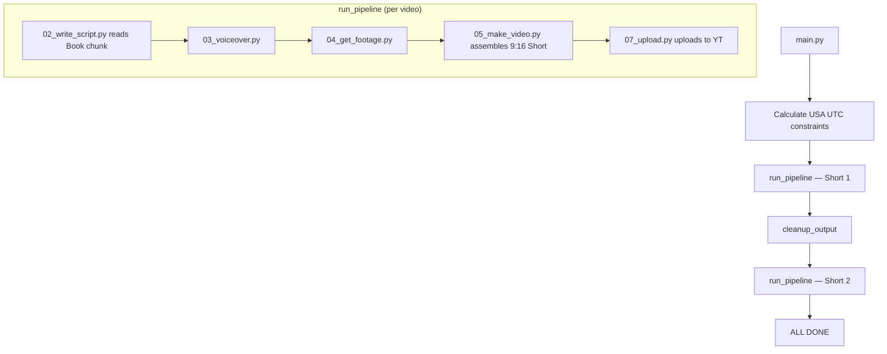

# 🎬 YouTubeBot — Fully Automated Book-to-Shorts Pipeline

> **Automated YouTube Shorts Channel Builder (USA Target Audience)**
> Sequentially reads books · AI-scripted angles · TTS voiceover · Premium Black Aesthetic · Centered 4-line subtitles · Music mixing · Auto-upload
> Last Updated: 2026-04-06

---

## 📋 Table of Contents

- [Overview](#overview)
- [Architecture & Flow](#architecture--flow)
- [Book Content System](#book-content-system)
- [Pipeline Steps](#pipeline-steps)
- [File Structure](#file-structure)
- [Configuration](#configuration)
- [Known Issues & Fixes](#known-issues--fixes)
- [Running the Bot](#running-the-bot)

---

## Overview

YouTubeBot has been entirely refactored into a **high-growth YouTube Shorts engine** specifically targeting a USA audience (18–35 demographic interested in money, growth, success, and discipline).

Instead of producing arbitrary motivational content, the system now **sequentially reads `.pdf` books** directly by extracting two pages per day. From these 2 physical pages of text, it generates 2 highly-engaging vertical YouTube Shorts offering two distinct angles (emotional storytelling vs. direct advice). 

| Component | Technology | Cost |
|-----------|-----------|------|
| **Script Writing** | **Groq API** (Llama 3.3 70B) | Free |
| **Paging System** | Custom Python Chunker + JSON Progress Tracking | Free |
| **Voiceover** | **Microsoft Edge TTS** | Free |
| **Video Background** | **Dynamic Black Generation** (lavfi black color) | Free |
| **Subtitles** | **FFmpeg SRT Centers** (Middle Center Alignment=10) | Free |
| **Background Music** | **Local MP3** file | Free |
| **Upload** | **YouTube Data API v3** | Free |

---

## Architecture & Flow

### Production Schedule ([main.py](file:///d:/YouTubeBot/main.py))

The bot automatically calculates and schedules the two Shorts to go live during USA prime time:

| Video | Publish Time (EST) | Upload Time (UTC) | Content Angle |
|-------|-------------------|-------------------|---------------|
| Short 1 | 9:00 AM EST | 14:00 UTC | Emotional Storytelling |
| Short 2 | 4:00 PM EST | 21:00 UTC | Direct Advice / Hard Truth |

### Pipeline Flow



**What changed from legacy versions:**
- No more 16:9 widescreen rendering. Natively built for 9:16 (1080x1920) Shorts.
- Thumbnail generator (`06_thumbnail.py`) dropped (Shorts natively handle thumbnails).
- Instagram upload and Reel specific rendering steps have been cleanly removed.
- Emailing features and Pollination AI placeholders have been securely removed.

---

## Book Content System

At the heart of the channel's value proposition is the `books/` directory parsing behavior.

1. Create a `books/` directory in the project root.
2. Drop in a PDF format book (e.g., `books/atomic_habits.pdf`).
3. During the execution for Video #1, the AI evaluates `books/progress.json`.
4. It natively indexes exactly 2 physical pages of text directly from the PDF (starting from `current_page`). You can manually open `progress.json` and change `current_page: 15` anytime to skip preface pages! You can also set `"end_page": 200` to prevent the bot from reading the book's index or glossary.
5. It hits the Groq API to convert these 2 pages of text into **2 different Shorts scripts** simultaneously.
6. The `current_page` is incremented by 2, and the secondary script is cached locally.
7. Next day, the bot naturally reads the next consecutive 2 pages. 
8. The bot will automatically flag when a book is complete and wait for the next `.pdf` file.

---

## Pipeline Steps

### Step 1: Script Generation — [02_write_script.py](file:///d:/YouTubeBot/scripts/02_write_script.py)
Reads the book slice, interacts with the Groq API, and transforms the raw text into highly engaging scripts targeted at the US market. Outputs a Hook, Script Body, and CTA alongside SEO metadata and viral hooks. Output paths are mapped to `/output/sections/`. Saves a `.json` cache to optimize API tokens on Video 2 runs.

### Step 2: Voiceover — [03_voiceover.py](file:///d:/YouTubeBot/scripts/03_voiceover.py)
Automatically passes all text sections to Microsoft Edge TTS (`en-US-GuyNeural`) utilizing a slightly slower and deeper pitch for a cinematic, intense delivery style.

### Step 3: Visual Background — [04_get_footage.py](file:///d:/YouTubeBot/scripts/04_get_footage.py)
Determines video length and calculates subtitle timings. Stock footage is skipped in favor of a clean, premium black aesthetic.

### Step 4: Short Assembly — [05_make_video.py](file:///d:/YouTubeBot/scripts/05_make_video.py)
The powerhouse renderer. 
It merges the MP3 objects, probes the duration for exact pacing, and generates a native **1080x1920 black background**. Subtitles are burned into the **absolute middle center** of the screen in small, readable **4-line blocks** (fontsize=14) for maximum retention.

### Step 5: Uploading — [07_upload.py](file:///d:/YouTubeBot/scripts/07_upload.py)
Connects to YouTube Data API v3. Uses the elite SEO metadata (curiosity-gap descriptions and 15+ hashtags) produced by Step 1. Auto-playlist organization is disabled to keep the feed clean.

---

## File Structure

```
d:\YouTubeBot\
├── .env                          # API keys (Groq)
├── credentials.json              # YouTube OAuth client secret
├── main.py                       # Production entry point (2 Shorts + Auto-upload)
│
├── books/                        # Library of PDF books
│   ├── progress.json             # Reading memory & tracking (editable start pages)
│   └── example_book.pdf          # Provided by User
│
├── scripts/
│   ├── 02_write_script.py        # Book Reader + AI script generator (Groq)
│   ├── 03_voiceover.py           # TTS voiceover (Edge TTS)
│   ├── 04_get_footage.py         # Stock footage selector (single clip)
│   ├── 05_make_video.py          # Short assembler (9:16 + subtitles + music)
│   └── 07_upload.py              # YouTube uploader via API
│
├── stock/                        # Stock footage library
│   ├── fire/       (8 clips)     
│   ├── morning/    (17 clips)    
│   ├── oceans/     (7 clips)     
│   └── plants/     (12 clips)    
│
├── music/
│   └── background.mp3            # Background music track
│
├── output/                       # Working directory (auto-cleaned between videos)
├── reels/                        # Legacy/archive (empty)
└── archive/                      # Backed-up final YouTube Shorts
```

---

## Configuration

Ensure `.env` contains:
```env
GROQ_API_KEY=your_key_here
YOUTUBE_CLIENT_SECRET=credentials.json
YOUTUBE_TOKEN_FILE=youtube_token.pickle
```
Ensure a `credentials.json` is located in the root representing your Google Cloud Platform YouTube API connection.

---

## Known Issues & Fixes

- **No Book File Crash**: If executing `main.py` without a `.pdf` in the `/books/` folder, the execution will pause and notify you to inject a book first. 
- **Center Text Safety**: Subtitles are set to `Alignment=10` to float in the dead center. This avoids overlap with the YouTube mobile UI (which covers the bottom 25% of the screen).
- **Audio Desync**: Re-encoded (not stream-copied) audio ensures that MP3 padding does not stagger your captions over time.
- **Quota Exceeded**: Be mindful that rendering and uploading daily automatically counts against standard free-tier YouTube daily limitations natively.

---

## Running the Bot

**Prerequisites:**
1. Python installed.
2. FFmpeg installed and running globally on `PATH`.
3. Valid `.env` configuration.
4. Add minimum one `.pdf` book format to the `/books/` directory.

**Execution:**
```bash
python main.py
```
*Sit back, grab a coffee. The AI will chunk a page, write 2 viral perspectives from it, render both Shorts vertically, and queue them directly to your YouTube dashboard hitting ideal USA viewing windows simultaneously.*
